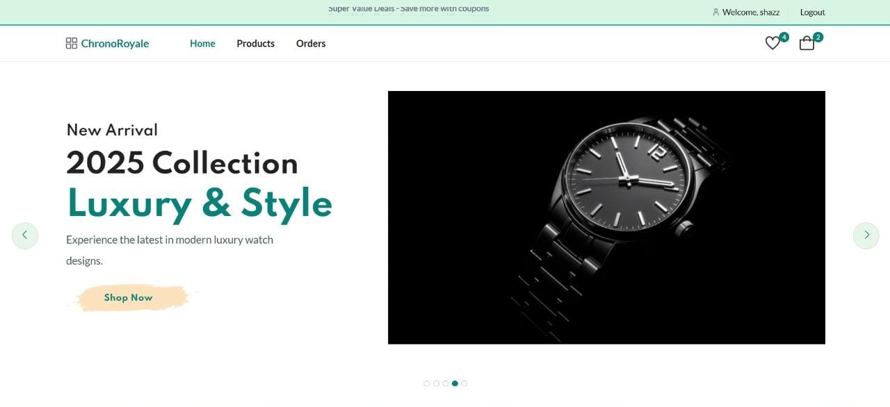
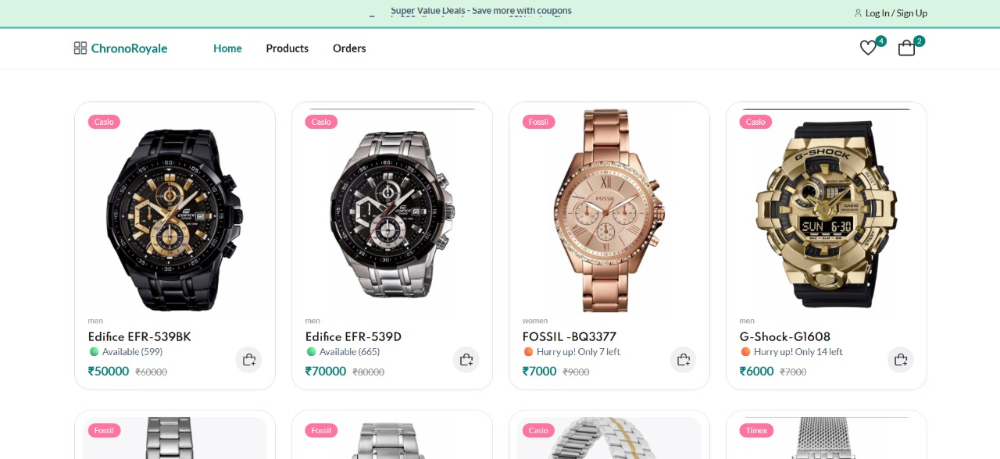
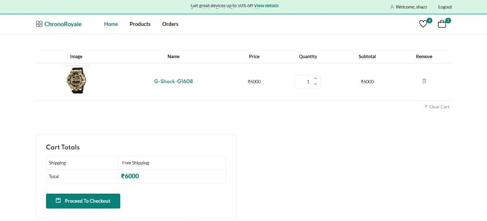

# ⌚ ChronoRoyale - Full Stack E-commerce WebApp

> ChronoRoyale is a modern full-stack e-commerce platform designed for luxury watch sales. It provides a seamless shopping experience with secure authentication, cart and wishlist system, order management, and a powerful admin dashboard for analytics and inventory control.

<div>
  
  
  
  
  
  
  
  
  
  
  
</div>

---

## 📋 Table of Contents

- [Introduction](#introduction)
- [⚙ Tech Stack](#-tech-stack)
- [🔋 Features](#-features)
- [🌐 Deployment](#-deployment)
- [📸 Preview](#-preview)
- [📦 Quick Start](#-quick-start)
- [📡 API Documentation](#-api-documentation)

---

## Introduction

ChronoRoyale is built to deliver a modern e-commerce experience specifically for luxury watches. Users can browse, wishlist, add to cart, and place orders. Admins can manage products, users, and orders with ease.

---

## ⚙ Tech Stack

| Layer      | Technologies Used |
|----------- |-----------------|
| Frontend   | HTML, CSS, JavaScript, Handlebars, Bootstrap 5, Chart.js |
| Backend    | Node.js, Express.js, MVC Architecture, Multer |
| Database   | MongoDB Atlas |
| Authentication | JWT, Session Cookies |
| Deployment | Render, GitHub |

---

## 🔋 Features

### 🛒 User Side
- User Authentication (Login / Signup)
- Product Details Page with Image Gallery
- Add to Cart / Wishlist
- Checkout with Address & Cash On Delivery
- Order Tracking & History
- Profile Management
- Image Zoom on Product Page

### 🛠️ Admin Dashboard
- Manage Products (Add / Edit / Delete)
- Order Management & Status Updates
- User Management (View, Block/Unblock)
- Real-Time Analytics & Reports
- Light & Dark Mode
- Soft Delete for Products

---

## 🌐 Deployment

The project is hosted on **Render**.

### 🔗 Live Links
- **User Panel:** [ChronoRoyale User](https://chronoroyale-ecommerce-webapp.onrender.com)  
- **Admin Panel:** [ChronoRoyale Admin](https://chronoroyale-ecommerce-webapp.onrender.com/admin)  

**Admin Credentials:**  
- Username: `admin`  
- Password: `123`  

---

## 📸 Preview

| Home Page | Product Page | Cart | Admin Dashboard |
|-----------|--------------|------|----------------|
|  |  |  |  |

---

## 📦 Quick Start (Setup Guide)

### 1️⃣ Clone the repository

```bash
git clone https://github.com/shasbinas/ChronoRoyale-Ecommerce-WebApp.git
cd ChronoRoyale-Ecommerce-WebApp
```

### 2️⃣ Install dependencies

```bash
npm install
```

### 3️⃣ Create `.env` file

```env
PORT=9002
DATABASE=ChronoRoyale
MONGO_DB_URI="your_mongodb_connection_string"
JWT_SECRET=your_secret_key
ADMIN_EMAIL=admin
ADMIN_PASSWORD=123
```

### 4️⃣ Start the server

```bash
npm run dev   # Development mode
npm start     # Production mode
```

Visit → **http://localhost:9002**

---

## 📡 API Documentation

### 🔐 Authentication

| Method | Endpoint | Description | Body / Params |
|--------|---------|------------|---------------|
| POST   | `/auth/register` | Register a new user | `{ name, email, password }` |
| POST   | `/auth/login`    | Login user & return token/session | `{ email, password }` |
| GET    | `/auth/logout`   | Logout user | - |
| GET    | `/auth/profile` *(Protected)* | Get logged-in user details | Header: `Authorization: Bearer <token>` |

---

### ⌚ Products

| Method | Endpoint | Description | Body / Params |
|--------|---------|------------|---------------|
| GET    | `/products`        | Get all products | Optional: `?search=&category=&sort=` |
| GET    | `/products/:id`    | Get single product details | Path: `id` |
| POST   | `/admin/add-product` *(Admin)* | Create new product | `{ name, brand, price, description, images[] }` |
| PUT    | `/admin/products/:id` *(Admin)* | Update product | Same as above |
| DELETE | `/admin/products/:id` *(Admin)* | Delete product | Path: `id` |

---

### 🛒 Cart

| Method | Endpoint | Description | Body / Params |
|--------|---------|------------|---------------|
| POST   | `/add-to-cart`       | Add item to cart | `{ productId, quantity }` |
| GET    | `/cart`             | Get user cart | - |
| GET    | `/cart/clear`       | Clear all items in cart | - |
| GET    | `/cart/remove/:productId` | Remove selected item from cart | Path: `productId` |

---

### ❤️ Wishlist

| Method | Endpoint | Description | Body / Params |
|--------|---------|------------|---------------|
| POST   | `/add-to-wishlist`           | Add item to wishlist | `{ productId }` |
| GET    | `/wishlist`                  | Get wishlist items | - |
| POST   | `/remove-from-wishlist`      | Remove from wishlist | `{ productId }` |

---

### 📦 Orders

| Method | Endpoint | Description | Body / Params |
|--------|---------|------------|---------------|
| POST   | `/place-order`               | Place new order | `{ cartItems[], address, paymentMethod }` |
| GET    | `/order-history`             | Get logged-in user orders | - |
| GET    | `/orders/:id`                | Get order details | Path: `id` |
| GET    | `/order-success`             | Order success page | - |
| POST   | `/create-address`            | Add new address | `{ addressFields }` |
| GET    | `/checkout`                  | Checkout page | - |
| POST   | `/update-order-status/:id/:status` *(Admin)* | Update order status | Path: `id`, `status` |

---

### 🛠 Admin

| Method | Endpoint | Description | Body / Params |
|--------|---------|------------|---------------|
| GET    | `/admin/dashboard`           | Admin dashboard overview | - |
| GET    | `/admin/users-list`          | List all users | - |
| POST   | `/admin/block-user/:id`      | Block/Unblock user | Path: `id` |
| GET    | `/admin/products-list`       | List all products | - |
| GET    | `/admin/products/edit/:id`   | Edit product page | Path: `id` |
| POST   | `/admin/edit-product/:id`    | Edit product details | Same as product creation body |
| POST   | `/admin/add-product`         | Add new product | `{ name, brand, price, description, images[] }` |
| POST   | `/admin/products/delete/:id` | Delete product | Path: `id` |
| GET    | `/admin/orders-list`         | List all orders | - |
| GET    | `/admin/orders/:id`          | Order details page | Path: `id` |
| GET    | `/admin/add-product`         | Add product page | - |
> **Note:** Protected routes require authentication headers:


---
If you like this project, **please ⭐ star the repo!**
